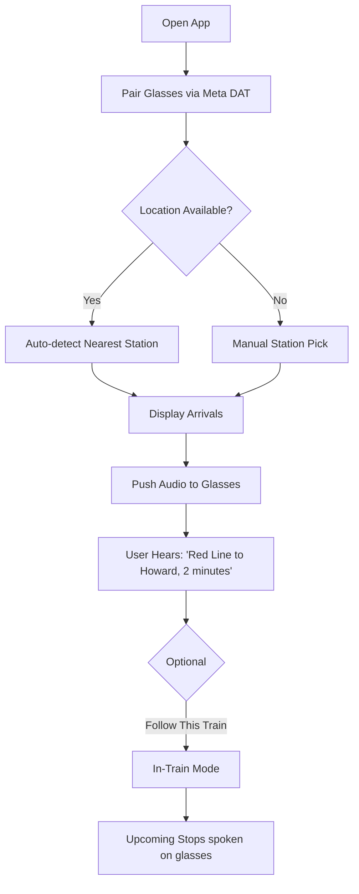
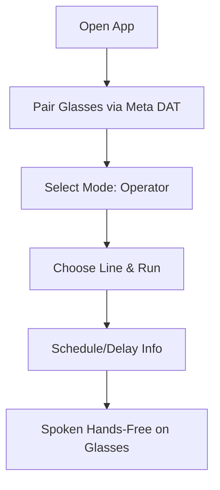
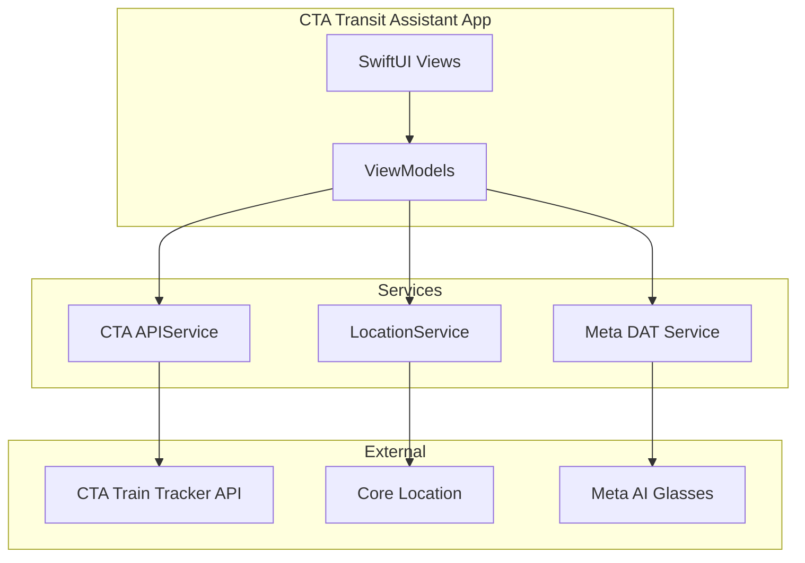

# CTA Transit Assistant — Mobile App Design Specification

## 1. Overview

Hands-free CTA 'L' train arrival info on Meta AI Glasses. Companion mobile app for pairing, station selection, and settings.

**Value Proposition:** Transit becomes safer and more accessible when information is hands-free and audio-first for riders (especially low vision/mobility) and transit operators.

---

## 2. User Flows

### Rider Flow

### Operator Flow

---

## 3. Mobile App Screens

| Screen | Purpose |
|--------|---------|
| **1. Pairing** | Connect to Meta AI Glasses via Meta DAT |
| **2. Station Select** | Auto-detect nearest station OR manual pick from list |
| **3. Arrivals** | Live arrival predictions; push to glasses |
| **4. Follow This Train** | (Optional) In-train mode; upcoming stops |
| **5. Settings** | Notifications, operator mode toggle, accessibility |
| **6. Operator Mode** | Line/run selection, schedule view |

---

## 4. Technical Stack

| Component | Technology |
|-----------|------------|
| **Platform** | iOS (Swift 6, SwiftUI) |
| **Wearables** | Meta Wearables Device Access Toolkit (DAT) |
| **CTA Data** | CTA Train Tracker API: `ttarrivals.aspx`, `ttfollow.aspx` |
| **Location** | Core Location for station detection |
| **Min iOS** | 15.2 (per Meta DAT requirements) |

---

## 5. Architecture Diagram

---

## 6. Glasses Audio Guidelines

- **Keep utterances to 1–2 sentences max.** Long text is hard to follow in-ear.
- **Voice:** `com.apple.ttsbundle.Samantha-compact` (en-US female). When Meta DAT is wired, use AVSpeechSynthesizer or Meta's native TTS.
- **Batching:** For lists (stops, alerts), speak in chunks of 2 items with 3–4s delay between chunks.
- **Examples:** "Red Line to Howard, 2 minutes" / "Map at Clark/Lake. Tap a station to hear arrivals."

---

## 7. Data Models

- **CTAStation**: `mapId`, `stationName`, `lat`, `lon`, `route`
- **CTAArrival**: `route`, `destination`, `predictionMinutes`, `runNumber`
- **CTAStop**: For Follow This Train: `stopId`, `stopName`, `arrivalTime`

---

## 8. Prototype Checklist

- [ ] Meta DAT integration (pairing, audio push)
- [ ] CTA Arrivals API integration
- [ ] Station list + location-based nearest
- [ ] Basic UI: station pick, arrivals display
- [ ] Audio push to glasses
- [ ] Optional: Follow This Train flow
- [ ] Optional: Operator mode

---

## 9. API References

- **CTA Arrivals:** `https://lapi.transitchicago.com/api/1.0/ttarrivals.aspx?key={KEY}&mapid={STATION_ID}&outputType=JSON`
- **CTA Follow This Train:** `https://lapi.transitchicago.com/api/1.0/ttfollow.aspx?key={KEY}&runnumber={RUN}&outputType=JSON`
- **Meta DAT:** Swift Package Manager: `https://github.com/facebook/meta-wearables-dat-ios`
